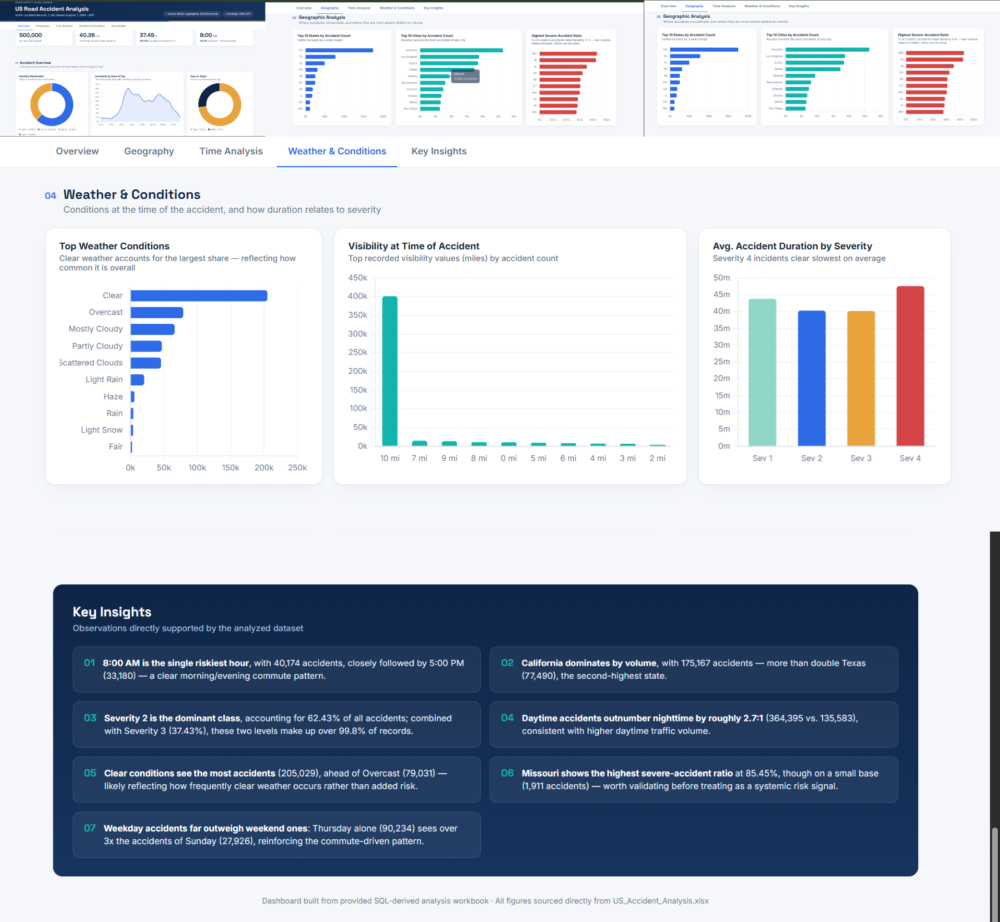

# 🚗 US Road Accident Analysis — SQL & Interactive Dashboard

An end-to-end data analytics project analyzing **500,000 US road accident records** using **MySQL, SQL, Python, Excel, and an interactive HTML dashboard**.

The project focuses on identifying accident patterns, severity trends, high-risk locations, weather conditions, and temporal patterns.

---

## 📊 Dashboard Preview



### 🔗 Interactive Dashboard

👉 **[Open Interactive US Road Accident Dashboard](report/US_Road_Accident_Dashboard.html)**

---

## 🎯 Project Objective

The objective of this project is to analyze a large-scale US road accident dataset and answer key business questions such as:

* How many accidents occurred?
* What is the average accident duration?
* Which severity levels are most common?
* What time of day has the highest number of accidents?
* Which states and cities experience the most accidents?
* How do accidents vary by weather condition?
* Which states have the highest proportion of severe accidents?
* How do accident patterns change by month, year, and day of the week?
* How does accident severity vary by hour?

---

## 🛠️ Tools & Technologies

| Tool                  | Purpose                                                      |
| --------------------- | ------------------------------------------------------------ |
| **MySQL**             | Data loading, cleaning, validation & analysis                |
| **SQL**               | Aggregation, filtering, window functions & business analysis |
| **Python**            | Automated extraction of SQL results into Excel               |
| **Excel**             | Analysis result storage and organization                     |
| **HTML / JavaScript** | Interactive dashboard                                        |
| **Chart.js**          | Dashboard visualizations                                     |
| **GitHub**            | Version control & project documentation                      |

---

## 🔄 Project Workflow

```text
500,000 Raw Accident Records
          ↓
      MySQL Import
          ↓
   Data Validation & Cleaning
          ↓
    Feature Preparation
          ↓
       SQL Analysis
          ↓
   Python Automation
          ↓
    Excel Analysis Tables
          ↓
 Interactive HTML Dashboard
```

---

## 🧹 Data Cleaning

The dataset was validated and cleaned using SQL before analysis.

Key cleaning steps included:

* Duplicate detection using `ROW_NUMBER()`
* NULL value analysis
* Blank-value handling
* Temperature validation
* Visibility validation
* Wind-speed validation
* Atmospheric pressure validation
* Precipitation validation
* Geographic coordinate validation
* Boolean infrastructure-column validation
* Date/time validation
* Accident duration calculation
* Creation of year, month, and hour features

The cleaned dataset contains **500,000 accident records**.

---

## 📈 SQL Analysis

The project analyzes accident data across several dimensions.

### Accident Overview

* Total accident count
* Average accident duration
* Severity distribution
* Severe accident percentage
* Accident count by hour
* Day vs. night accidents

### Geographic Analysis

* Top 10 cities by accident count
* Top 10 states by accident count
* States with the highest severe-accident ratio

### Time Analysis

* Accidents by hour
* Accidents by day of week
* Accidents by month
* Accidents by year
* Accident severity by hour

### Weather & Conditions

* Top weather conditions associated with accidents
* Severe accidents by weather condition
* Average accident duration by severity
* Weather conditions associated with longer accident durations
* Accident distribution by visibility

---

## 💡 Key Insights

The analysis identifies several important patterns:

* **500,000 accidents** were analyzed.
* The average accident duration was approximately **40.26 minutes**.
* **37.49%** of accidents were classified as Severity 3–4.
* **8:00 AM** was the highest accident hour, with **40,174 accidents**.
* Accident frequency shows distinct peaks during major commuting periods.
* Accident patterns vary considerably across states, cities, weather conditions, and time periods.

> All reported figures are derived from the SQL analysis performed on the 500,000-record dataset.

---

## 📂 Project Structure

```text
road-accident-analysis-sql-powerbi/
│
├── sql/
│   ├── 01_database_creation.sql
│   ├── 02_data_cleaning.sql
│   └── 03_business_analysis.sql
│
├── python/
│   └── export_accident_analysis.py
│
├── report/
│   └── US_Road_Accident_Dashboard.html
│
├── images/
│   └── dashboard.png
│
└── README.md
```

---

## 🧮 SQL Skills Demonstrated

* `SELECT`
* `WHERE`
* `GROUP BY`
* `ORDER BY`
* `COUNT()`
* `SUM()`
* `AVG()`
* `ROUND()`
* Subqueries
* CTEs
* `ROW_NUMBER()`
* Conditional aggregation
* Date/time functions
* Data validation
* Data cleaning
* Feature engineering

---

## 🐍 Python Automation

Python was used to connect to MySQL, execute the analysis queries, and automatically export the analysis results into a structured Excel workbook.

This reduced the need for manually exporting each SQL result separately.

---

## 📊 Dashboard

The interactive dashboard presents:

* KPI cards
* Severity distribution
* Accident trends by hour
* Day vs. night analysis
* Geographic analysis
* Time-based analysis
* Weather analysis
* Visibility analysis
* Key analytical insights

---

## 👨‍💻 Author

**Rohit Roy**

B.Tech — Computer Science & Engineering

Interested in **Data Analytics, SQL, Excel, Power BI/BI, and Business Intelligence**.

---

⭐ If you find this project useful, feel free to explore the SQL analysis and interactive dashboard.

